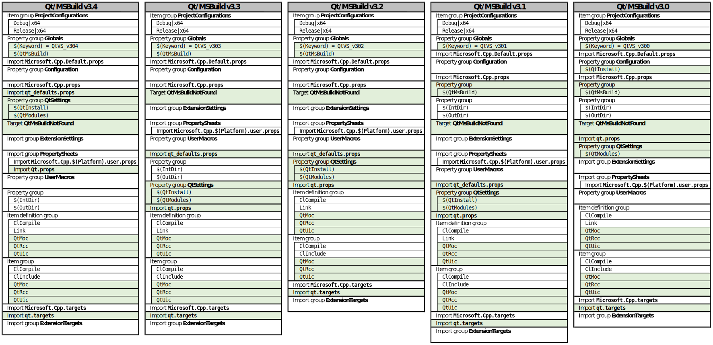

# Qt VS Tools - Project format versions

## Contents

* [Project format v3](#project-format-v3)
    * [v3.4](#v34)
    * [v3.3](#v33)
    * [v3.2](#v32)
    * [v3.1](#v31)
    * [v3.0](#v30)
* [Project format v2](#project-format-v2)
* [Project format v1](#project-format-v1)

## Project format v3

### v3.4
**>= [Qt Visual Studio Tools v2.7.1](https://download.qt.io/official_releases/vsaddin/2.7.1/)**

**`Integrate Qt.props in the VS Property Manager`** 
`commit cb9ec156845a9efc163a9c67d7a54c8ca790e805` 
`Author: Miguel Costa <miguel.costa@qt.io>` 
`Date:   Fri Dec 11 16:58:06 2020 +0100`

    The Qt property definitions file (Qt.props) will now be shown in the
    evaluation list of the Property Manager window. This allows the user to
    customize the order of evaluation of Qt.props in relation to other
    property files loaded during the build, thereby defining the correct
    dependency between Qt properties and other build settings. Previously,
    the order of evaluation of Qt.props was fixed and could only be changed
    by manually editing the project file's XML.

    Allowing Qt.props to be manipulated in the Property Manager window will
    enable the user to define properties and default metadata within the
    Qt.props itself. To ensure these custom definitions are not lost when
    installing Qt/MSBuild files, the Qt.props file will no longer be
    replaced during start-up.

> ***[Sample project file](304/QtProjectV304.vcxproj)***

 

### v3.3
**[Qt Visual Studio Tools v2.6.0](https://download.qt.io/official_releases/vsaddin/2.6.0/)**

**`Fix ignoring VC property changes (project format v3.3)`** 
`commit 621efbcc92be6e1a9869a15a850b9bd8cccf2e97` 
`Author: Miguel Costa <miguel.costa@qt.io>` 
`Date:   Tue Jun 9 10:24:54 2020 +0200`

    This change introduces project format version 3.3, which fixes issues
    related to modified values of VC properties (e.g. $(IntDir)) being
    ignored when evaluating Qt build settings.

    MSBuild evaluates properties by order of definition; dependencies are
    resolved by using the latest evaluation of referred properties. As such,
    any subsequent changes to the value of dependencies will not be
    reflected in previously evaluated properties.

    Redefinitions of VC properties are stored in uncategorized property
    groups (i.e. <PropertyGroup> elements without a Label attrib) inside the
    MSBuild project file; if no available group is found, Visual Studio will
    create a new one. The incorrect evaluation of Qt properties happens when
    new property groups are created after the definition of Qt properties,
    such that the evaluation of Qt properties will be using outdated values
    of VC properties.

    Project format version 3.3 addresses this issue by adding property
    groups for VC property storage in a correct location, with respect to
    Qt build settings definitions.

> ***[Sample project file](303/QtProjectV303.vcxproj)***

 

### v3.2
**[Qt Visual Studio Tools v2.5.1](https://download.qt.io/official_releases/vsaddin/2.5.1/)**

**`Fix incompatibilities with property sheets`** 
`commit 1a93741cadaa26b49cc4dc02d09ea7249cbea6fe` 
`Author: Miguel Costa <miguel.costa@qt.io>` 
`Date:   Thu Nov 21 16:21:35 2019 +0100`

    Updated the format of Qt projects to better match the requirements for
    Visual Studio C++ projects (*) that enable integrating with the IDE, in
    particular, that allow external property sheets to be referenced.
(*) https://docs.microsoft.com/en-us/cpp/build/reference/cxproj-file-structure#per-configuration-propertygroup-elements

> ***[Sample project file](302/QtProjectV302.vcxproj)***

 

### v3.1
**[Qt Visual Studio Tools v2.4.2](https://download.qt.io/official_releases/vsaddin/2.4.2/)**

**`Implement project format v3.1`** 
`commit fdbec35c590f524f6f9ce8f2e6a7328f2f3df508` 
`Author: Miguel Costa <miguel.costa@qt.io>` 
`Date:   Wed Sep 18 18:47:30 2019 +0200`

    This change introduces a revision of the v3 project format, which will
    now allow Qt settings to reference user macros defined in imported
    property sheets. This includes the following changes to the order of
    property evaluation:
     - "QtSettings" property group moved to after the import of user
     property sheets;
     - QtInstall property moved from the "Configuration" property group
    to the "QtSettings" property group;
     - Import of qt.props moved to after the "QtSettings" property group.

> ***[Sample project file](301/QtProjectV301.vcxproj)***

 

## v3.0
**[Qt Visual Studio Tools v2.4.0](https://download.qt.io/official_releases/vsaddin/2.4.0/)**

**`Edit Qt settings in property pages (V3 format)`** 
`commit 805e9ed6f14fb0a4d9dd8ce6a23631ca215b304a` 
`Author: Miguel Costa <miguel.costa@qt.io>` 
`Date:   Thu Jun 20 13:54:49 2019 +0200`

    Qt settings are now configured in the project property pages. This
    includes the possibility to have different versions of the Qt settings
    per project configuration. Previously, the Qt settings were edited in a
    custom dialog, allowing only a single version of the settings that
    would apply to all project configurations.

    This change breaks the current version of the support for Qt VS Tools
    projects. A new version (V3) of the project format is introduced. This
    new format allows Qt settings to be stored in the same way as other
    project properties. Previous versions will still work and a later change
    will introduce the possibility to convert from previous versions to V3.

> ***[Sample project file](303/QtProjectV300.vcxproj)***

---

## Project format v2
**[Qt Visual Studio Tools v2.1.1](https://download.qt.io/official_releases/vsaddin/2.1.1/)**

### Project file outline

- ItemGroup **ProjectConfiguration**
- PropertyGroup **Globals**
    - Keyword **Qt4VSv1.0**
- Import **Microsoft.Cpp.Default.props**
- PropertyGroup **Configuration**
- Import **Microsoft.Cpp.props**
- ImportGroup **ExtensionSettings**
- ImportGroup **Shared**
- ImportGroup **PropertySheets**
- PropertyGroup **UserMacros**
- PropertyGroup
    - Property **OutDir**
    - Property **IntDir**
    - ...
- ItemDefinitionGroup
    - **ClCompile**
    -  **Link**
    - ...
- ItemGroup
    - **CustomBuild** (*MOC header*)
    - *N* x **ClCompile** (*MOC-generated CPP source*), where N = number of configurations
        - (*N* - 1) x **ExcludedFromBuild** (*configuration*)
    - **CustomBuild** (*QRC resources*)
    - *N* x **ClCompile** (*RCC-generated CPP source*), where N = number of configurations
        - (*N* - 1) x **ExcludedFromBuild** (*configuration*)
    - **CustomBuild** (*UI form*)
    - **ClInclude** (*UIC-generated header*)
    - **ClInclude** (*other headers*)
    - **ClCompile** (*other CPP sources*)
    - ...
- Import **Microsoft.Cpp.targets**
- ImportGroup **ExtensionTargets**
- ProjectExtensions / VisualStudio
    - UserProperties
        - **MocDir**
        - **UicDir**
        - **RccDir**
        - **lupdateOptions**
        - **lupdateOnBuild**
        - **lreleaseOptions**
        - **Qt5Version_x0020_x64**
        - **MocOptions**

 > ***[Sample project file](200/QtProjectV200.vcxproj)***

---

## Project format v1

Output of `qmake` using the VC template:

    qmake -tp vc

### Project file outline

- ItemGroup **ProjectConfiguration**
- PropertyGroup **Globals**
    - Keyword **Qt4VSv1.0**
- Import **Microsoft.Cpp.Default.props**
- PropertyGroup **Configuration**
- Import **Microsoft.Cpp.props**
- ImportGroup **ExtensionSettings**
- ImportGroup **PropertySheets**
- PropertyGroup **UserMacros**
- PropertyGroup
    - Property **OutDir**
    - Property **IntDir**
    - ...
- ItemDefinitionGroup
    - **ClCompile**
    -  **Link**
    - ...
- ItemGroup
    - **CustomBuild** (*MOC header*)
    - *N* x **ClCompile** (*MOC-generated CPP source*), where N = number of configurations
        - (*N* - 1) x **ExcludedFromBuild** (*configuration*)
    - **CustomBuild** (*QRC resources*)
    - *N* x **ClCompile** (*RCC-generated CPP source*), where N = number of configurations
        - (*N* - 1) x **ExcludedFromBuild** (*configuration*)
    - **CustomBuild** (*UI form*)
    - **ClInclude** (*UIC-generated header*)
    - **ClInclude** (*other headers*)
    - **ClCompile** (*other CPP sources*)
    - ...
- Import **Microsoft.Cpp.targets**
- ImportGroup **ExtensionTargets**

 > ***[Sample project file](100/QtProjectV100.vcxproj)***
